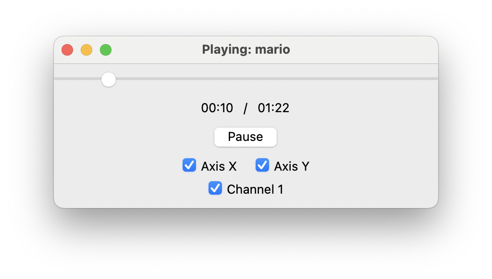

# CNC-MelodyMaker

**CNC-MelodyMaker** is a Python-based project that converts MIDI files into motion commands for a CNC machine. By leveraging the musical data from MIDI files, this tool allows you to "play" music using the stepper motors of your CNC machine, creating audible tunes through precise movements.

## Table of Contents

- [CNC-MelodyMaker](#cnc-melodymaker)
  - [Table of Contents](#table-of-contents)
  - [Introduction](#introduction)
  - [Features](#features)
  - [Requirements](#requirements)
  - [Installation](#installation)
  - [Usage](#usage)
    - [Converting MIDI Files](#converting-midi-files)
    - [Previewing Songs](#previewing-songs)
    - [Playing Music on CNC](#playing-music-on-cnc)
  - [Directory Structure](#directory-structure)
  - [Warnings](#warnings)
  - [Contributing](#contributing)
  - [License](#license)

## Introduction

CNC-MelodyMaker transforms MIDI files into motion commands that can be interpreted by a CNC machine running GRBL firmware. This enables the CNC machine's stepper motors to produce musical notes, effectively turning your CNC into a musical instrument.

## Features

- **Convert MIDI to CNC Commands**: Translates MIDI note data into motion commands compatible with GRBL-controlled CNC machines.
- **Multi-Axis Support**: Utilizes multiple axes (e.g., X and Y) to play multiple notes simultaneously.
- **Song Preview**: Provides a preview of the converted songs using your computer's audio system.
- **User-Friendly Interface**: Includes command-line prompts for selecting files and configuring settings.
- **Python-Based**: Batteries-included Python scripts that are easy to modify and extend.

## Requirements

- **Python 3.x**
- **CNC Machine**: A CNC machine that supports [GRBL commands](https://github.com/grbl/grbl) over a serial port.
- **MIDI Files**: Place your own MIDI files in the `midi/` directory.

## Installation

1. **Clone the Repository**:

   ```bash
   git clone https://github.com/suhjae/CNC-MelodyMaker.git
   cd CNC-MelodyMaker
   ```

2. **Install Dependencies**:

   ```bash
   pip install -r requirements.txt
   ```

   - **Note**: Installing `pyaudio` might require additional system dependencies. Refer to [PyAudio Installation](https://people.csail.mit.edu/hubert/pyaudio/#downloads) for assistance.

3. **Prepare MIDI Files**:

   - Place your `.mid` files into the `midi/` directory.

## Usage

### Converting MIDI Files

Use `convert.py` to convert MIDI files into JSON files containing motion commands.

```bash
python3 convert.py
```

This command will show a series of prompts to guide you through the conversion process.

### Previewing Songs



Use `preview.py` to listen to a preview of the converted songs on your computer.

```bash
python3 preview.py
```

**Features**:

- **Song Selection**: Choose from available songs in the `music/` directory.
- **Multi-Channel Support**: Automatically detects and plays multi-channel songs.
- **Interactive GUI**:
  - Displays playback progress and remaining time.
  - Allows pausing and seeking within the song.
  - Enables or disables individual channels and axes in real-time.

### Playing Music on CNC

Use `main.py` to send the motion commands to your CNC machine.

```bash
python3 main.py
```

**Safety Warning**:

> The current code may cause your CNC machine to reach its physical limits (hit the walls) if the song is long enough. **Monitor your CNC machine during playback and be prepared to stop it by pressing `Ctrl + C` (or by any means) before it hits the limits.**

**Steps**:

1. **Configure Serial Port**:

   - Ensure your CNC machine is connected and note the serial port (e.g., `/dev/ttyUSB0`).

2. **Run the Script**:

   - The script will automatically detect the available serial ports and prompt you to select one.
   - Then it will home the CNC machine and ask you to choose a song to play.

3. **Monitor Playback**:

   - Keep an eye on your CNC machine to prevent it from hitting physical limits.
   - Press `Ctrl + C` (or Kill switch) to stop playback immediately if necessary.

## Directory Structure

```
CNC-MelodyMaker/
├── README.md
├── arduino_config.json
├── convert.py
├── main.py
├── midi/
│   └── ...
├── music/
│   └── ...
├── preview.py
└── test.py
```

- **README.md**: Project documentation.
- **arduino_config.json**: Configuration file for serial communication.
- **convert.py**: Script to convert MIDI files to JSON motion commands.
- **main.py**: Script to send motion commands to the CNC machine.
- **preview.py**: Script to preview songs on your computer.
- **midi/**: Directory containing MIDI files.
- **music/**: Directory containing converted JSON files.
- **test.py**: Additional testing scripts.

## Warnings

- **Physical Limits**: The CNC machine may eventually reach its physical limits during playback. Always supervise the machine and be ready to stop it.
- **Emergency Stop**: Press `Ctrl + C` in the terminal to immediately halt the machine.
- **Machine Damage**: Failure to monitor the CNC machine can result in damage to the machine or injury. Use this tool responsibly.

## Contributing

Contributions are welcome! Feel free to submit issues or pull requests to improve the project.

## License

This project is licensed under the [MIT License](LICENSE).

---

**Disclaimer**: Use this tool at your own risk. The developers are not responsible for any damage caused to your CNC machine or any other equipment.
